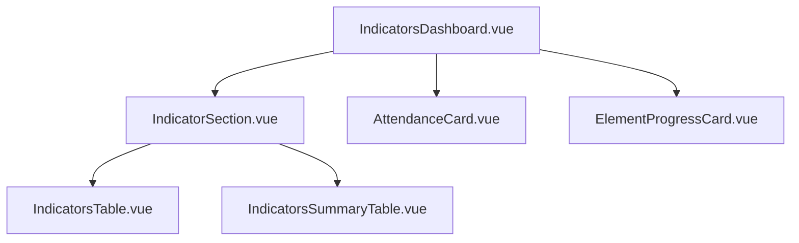
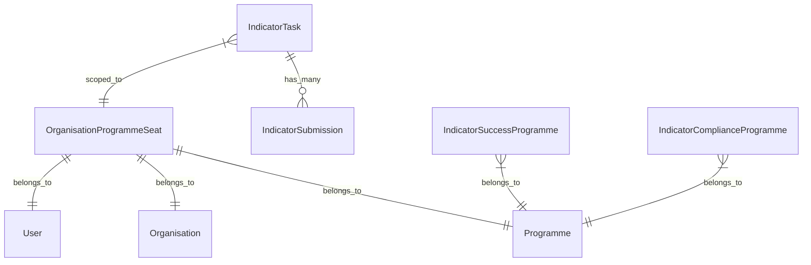

# Indicators on the Entrepreneur Dashboard

## User Experience Overview

The Indicators dashboard provides entrepreneurs with a comprehensive view of their indicator tasks, attendance statistics, and element progress. This section explains when and why users see different indicator content, along with common issues that may arise.

### Dashboard Visibility Conditions

#### Prerequisites for Indicator Tab Display

1. **Active Programme Seat Required**: Users must have an active `OrganisationProgrammeSeat` record for the current organisation
2. **Indicator Tasks Must Exist**: The system must find indicator tasks assigned to the user via the `IndicatorTaskListingService`
3. **Organisation Must Be Active**: The organisation must have `active = true`

If any of these conditions are not met, users will either not see the indicators tab or will see a fallback empty state.

#### What Users See When Conditions Are Met

The indicators dashboard displays four main sections:

1. **Success Indicators** - Tasks grouped by status (Open, Verifying, Complete)
2. **Compliance Indicators** - Similarly grouped tasks
3. **Attendance Cards** - Learning and Mentoring attendance statistics
4. **Element Progress Card** - Overall programme element progress

### Data Loading Strategy

The system uses a mixed loading approach for optimal performance:

-   **Eager Data** (loads immediately):
    -   Success and Compliance indicator lists
    -   Programme start date
-   **Deferred Data** (loads asynchronously):
    -   Dashboard summary tables (`successIndicatorsDashboard`, `complianceIndicatorsDashboard`)
    -   Attendance statistics (`learningAttendance`, `mentoringAttendance`)
    -   Element progress statistics (`elementProgressStats`)

### Common Issues and Troubleshooting

#### 1. "No Indicators Tab Visible"

**Symptoms**: User doesn't see indicators tab at all
**Causes**:

-   No active programme seat for the organisation
-   User has no assigned indicator tasks
-   Organisation is inactive

**Diagnostic Steps**:

```sql
-- Check if user has programme seat
SELECT * FROM organisation_programme_seats
WHERE user_id = ? AND organisation_id = ?;

-- Check if user has indicator tasks
SELECT COUNT(*) FROM indicator_tasks
WHERE entrepreneur_id = ? AND organisation_id = ?;
```

#### 2. "Empty Dashboard with No Error"

**Symptoms**: Indicators tab appears but shows empty content
**Causes**:

-   Programme seat exists but no indicator tasks assigned yet
-   All indicators are filtered out by the current date filter (beforeDate = end of current month)
-   Indicators exist but are all outside the current programme period

**Resolution**: This is expected behavior and shows the fallback data structure from `OrganisationController::fallbackIndicatorData()`

#### 3. "Attendance Cards Not Showing"

**Symptoms**: Success/Compliance indicators display but no attendance cards
**Causes**:

-   No attendance compliance indicators configured for current programme month
-   User has no Engauge sessions to track attendance against
-   `getCurrentProgrammeMonth()` returning null

**Investigation**:

```php
// Check current programme month calculation
$currentMonth = $user->getCurrentProgrammeMonth();

// Verify attendance indicators exist
$attendanceIndicators = IndicatorComplianceProgramme::query()
    ->where('programme_id', $programmeId)
    ->whereHas('indicator', function($q) {
        $q->whereIn('type', ['attendance-learning', 'attendance-mentoring']);
    })
    ->exists();
```

#### 4. "Element Progress Card Missing"

**Symptoms**: Other sections load but element progress doesn't appear
**Causes**:

-   No element progress compliance indicators configured
-   No indicator tasks of type `ELEMENT_PROGRESS` submitted yet
-   Element progress calculation service failing

**Logs to Check**:

-   Look for `IndicatorElementProgressService` errors in application logs
-   Check for `ProgrammeElementProgressCalculationServiceFactory` failures

#### 5. "Dashboard Summary Tables Not Loading"

**Symptoms**: Indicator lists show but summary tables remain empty/loading
**Causes**:

-   `IndicatorDashboardGridService` encountering errors
-   Database query performance issues with large datasets
-   Invalid programme or organisation data

**Performance Notes**:

-   Dashboard grid data is cached for 5 minutes (`CACHE_TTL = 300`)
-   Large programmes with many indicators may experience slower load times

## Technical Architecture

<MermaidDiagramViewer diagramName="indicators-entrepreneur-dashboard" />

### Service Orchestration

The indicator dashboard uses a **Facade Pattern** to coordinate multiple specialized services, as shown in the architecture diagram above.

#### Core Services

##### 1. IndicatorEntrepreneurDashboardFacade

**Location**: `App\Facades\IndicatorEntrepreneurDashboardFacade`

**Purpose**: Primary interface providing unified access to all indicator dashboard functionality

**Key Methods**:

-   `getAllDashboardData(?Carbon $beforeDate = null): array` - Returns complete dashboard dataset
-   `seatHasIndicatorTasks(): bool` - Quick check for indicator existence
-   `getSuccessIndicatorList(?Carbon $beforeDate = null): array` - Success indicators grouped by status
-   `getComplianceIndicatorList(?Carbon $beforeDate = null): array` - Compliance indicators grouped by status

##### 2. IndicatorTaskListingService

**Location**: `App\Services\Indicators\IndicatorTaskListingService`

**Purpose**: Handles fetching and formatting indicator tasks for display

**Architecture**:

-   Scoped to specific `OrganisationProgrammeSeat`
-   Filters tasks by user, organisation, and programme
-   Groups indicators by status: `open`, `verifying`, `complete`

**Key Methods**:

-   `getFormattedSuccessIndicatorsForUser(?Carbon $dueBefore = null): array`
-   `getFormattedComplianceIndicatorsForUser(?Carbon $dueBefore = null): array`
-   `hasIndicatorTasks(): bool`

##### 3. IndicatorDashboardGridService

**Location**: `App\Services\Indicators\IndicatorDashboardGridService`

**Purpose**: Generates dashboard summary table data showing indicator progress across programme months

**Caching Strategy**:

-   Cache TTL: 5 minutes (300 seconds)
-   Cache keys include user, organisation, and indicator type for proper isolation

**Key Methods**:

-   `getSuccessIndicatorsDashboardData(): array`
-   `getComplianceIndicatorsDashboardData(): array`

**Data Structure**: Returns programme timeline with indicator status for each month:

```php
[
    'indicators' => [...],      // List of indicators
    'programmeMonths' => [...], // Month headers
    'currentMonth' => int,      // Current programme month
    'programmeDuration' => int  // Total programme length
]
```

##### 4. IndicatorAttendanceStatService

**Location**: `App\Services\Indicators\IndicatorAttendanceStatService`

**Purpose**: Calculates attendance statistics for learning and mentoring sessions

**Dependencies**:

-   `ProgrammeSessionAttendanceServiceFactory` - Handles session attendance calculation
-   Uses `SessionCategoryType` enum for learning vs mentoring differentiation

**Key Methods**:

-   `getAttendanceStats(SessionCategoryType $type): ?array`

**Logic Flow**:

1. Determine target attendance percentage for current programme month
2. Calculate actual attendance using session attendance service
3. Return combined stats with target vs actual percentages

##### 5. IndicatorElementProgressService

**Location**: `App\Services\Indicators\IndicatorElementProgressService`

**Purpose**: Tracks and reports element completion progress throughout the programme

**Caching**:

-   Programme stats: 8 hours (slower-changing data)
-   Current stats: 5 minutes (faster-changing data)

**Key Methods**:

-   `getConsolidatedStats(): ?array`

**Returns**:

```php
[
    'programme_stats' => [...], // Historical progress by month
    'current_stats' => [...]    // Current overall progress percentage
]
```

### Controller Integration

#### OrganisationController Integration

**Method**: `getIndicatorsData(Request $request, Organisation $organisation, User $user): array`

**Key Logic**:

1. **Programme Seat Validation**: Checks `$user->currentProgrammeSeat($organisation)`
2. **Facade Creation**: Uses factory to create dashboard facade instance
3. **Data Splitting**: Separates eager vs deferred data for optimal loading
4. **Error Handling**: Falls back to empty data structure on errors

**Eager vs Deferred Loading**:

```php
// Loaded immediately
$eagerData = [
    'successIndicators' => $dashboardInterface->getSuccessIndicatorList($beforeDate),
    'complianceIndicators' => $dashboardInterface->getComplianceIndicatorList($beforeDate),
    'programmeStartDate' => $programmeSeat?->contract_start_date ?? '',
];

// Loaded asynchronously via Inertia::defer()
$deferredData = [
    'successIndicatorsDashboard' => Inertia::defer(fn () => $dashboardInterface->getSuccessIndicatorSummaryTableData(), 'indicator_dashboards'),
    'complianceIndicatorsDashboard' => Inertia::defer(fn () => $dashboardInterface->getComplianceIndicatorSummaryTableData(), 'indicator_dashboards'),
    'learningAttendance' => Inertia::defer(fn () => $dashboardInterface->getLearningAttendanceStats(), 'attendance_stats'),
    'mentoringAttendance' => Inertia::defer(fn () => $dashboardInterface->getMentoringAttendanceStats(), 'attendance_stats'),
    'elementProgressStats' => Inertia::defer(fn () => $dashboardInterface->getElementProgressStats(), 'element_progress_stats'),
];
```

### Frontend Components

#### Component Hierarchy



#### Main Components

##### 1. IndicatorsDashboard.vue

**Location**: `resources/ts/Components/App/Dashboard/IndicatorsDashboard.vue`

**Purpose**: Root component orchestrating the entire indicators dashboard

**Props**:

-   `successIndicators: IndicatorTaskGrouped`
-   `complianceIndicators: IndicatorTaskGrouped`
-   `programmeStartDate: string`
-   `successIndicatorsDashboard: IndicatorDashboardData`
-   `complianceIndicatorsDashboard: IndicatorDashboardData`
-   `learningAttendance?: AttendanceStats`
-   `mentoringAttendance?: AttendanceStats`
-   `elementProgressStats?: ConsolidatedElementProgressStats`

**Layout**: Vertical sections with responsive grid for attendance cards

##### 2. IndicatorSection.vue

**Location**: `resources/ts/Components/App/Indicators/IndicatorSection.vue`

**Purpose**: Displays indicator lists with status filtering and summary table

**Key Features**:

-   Dynamic status button filtering (Open/Verifying/Complete)
-   Shows counts for each status in button labels
-   Automatically selects first non-empty status as default
-   Programme start date display for success indicators

**Child Components**:

-   `IndicatorsTable.vue` - Individual task listing
-   `IndicatorsSummaryTable.vue` - Programme timeline view

##### 3. AttendanceCard.vue

**Location**: `resources/ts/Components/App/Indicators/AttendanceCard.vue`

**Purpose**: Visual attendance percentage display with progress bars

**Features**:

-   Conditional rendering (only shows if marked sessions exist)
-   Target vs actual percentage comparison
-   Visual progress bar with attended (green) and missed (red) portions
-   Separate cards for learning and mentoring attendance

**Props**:

-   `attendance?: AttendanceStats`
-   `type: "learning" | "mentoring"`

##### 4. ElementProgressCard.vue

**Location**: `resources/ts/Components/App/Indicators/ElementProgressCard.vue`

**Purpose**: Shows overall element completion progress

**Layout**:

-   Left panel: Large current percentage display
-   Right panel: Historical progress by programme month
-   Responsive design with horizontal scrolling for month data

**Props**:

-   `elementProgressStats?: ConsolidatedElementProgressStats`

### Data Models and Types

#### Key TypeScript Interfaces

**IndicatorTaskGrouped**:

```typescript
interface IndicatorTaskGrouped {
    open: IndicatorTask[];
    verifying: IndicatorTask[];
    complete: IndicatorTask[];
}
```

**IndicatorDashboardData**:

```typescript
interface IndicatorDashboardData {
    indicators: IndicatorDashboardRow[];
    programmeMonths: number[];
    currentMonth: number | null;
    programmeDuration: number;
    type?: "success" | "compliance";
}
```

**AttendanceStats**:

```typescript
interface AttendanceStats {
    attended: number;
    missed: number;
    percentage: number;
    target_percentage?: string;
}
```

### Database Models

#### Core Indicator Models

1. **IndicatorTask** - Individual tasks assigned to entrepreneurs
2. **IndicatorSuccess** - Success indicator definitions
3. **IndicatorCompliance** - Compliance indicator definitions
4. **IndicatorSubmission** - Submitted responses to indicator tasks
5. **OrganisationProgrammeSeat** - Links users to programmes within organisations

#### Key Relationships



### Performance Considerations

#### Caching Strategy

-   **Dashboard Grid Data**: 5 minutes (frequently changing due to submissions)
-   **Element Progress Targets**: 8 hours (relatively static programme structure)
-   **Attendance Stats**: 5 minutes (session attendance can change)

#### Database Query Optimization

-   Eager loading used extensively to prevent N+1 queries
-   Complex joins in `IndicatorElementProgressService` to minimize database hits
-   Scoped queries by user/organisation/programme for efficient filtering

#### Frontend Performance

-   Deferred loading for heavy dashboard calculations
-   Conditional component rendering to avoid unnecessary computations
-   Computed properties for reactive percentage calculations

### Error Handling and Logging

The system implements comprehensive error handling with specific log contexts:

```php
Log::error('Error fetching indicator data for tab view', [
    'user_id' => $user->id,
    'organisation_id' => $organisation->id,
    'error' => $e->getMessage(),
]);
```

**Common Error Scenarios**:

-   Missing programme seats (warning level)
-   Indicator calculation failures (error level)
-   Session attendance calculation errors (error level)
-   Database connectivity issues (error level)

All services gracefully degrade to null/empty responses when errors occur, ensuring the dashboard remains functional even with partial data failures.
